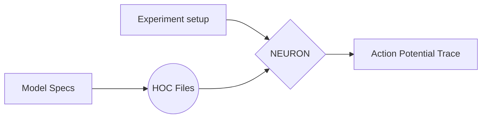

# Measurements draft
## Table of contents
1.	what's a nerve cell, simple cell topology.
2.	Why do computational modelling?.
3.	 Introducing _NEURON_
4.	what is an action potential ?
5.	what affects action potenials (model parameters , channels...)?
6.	what are the possible ways to compare two action potentials? (point-to-point vs features based comparison)
7. 	what features are we extracting ? (list them with pics and sudo code)
  

## draft 
### 1. what's a nerve cell , simple cell topology.


The Nervous System Has Two Classes of Cells:_ nerve cells, or neurons, and glial cells, or glia.
Nerve Cells Are the Signaling Units of the Nervous System.

A typical neuron has four morphologically defined regions: 
1. the cell body
2. dendrites
3. axon
4. and presynaptic terminals 


The cell body or __soma__ is the metabolic center of the cell. It contains the nucleus, which contains the genes of the cell, and the endoplasmic reticulum, an extension of the nucleus where the cell’s proteins are synthesized. 
The cell body usually gives rise to two kinds of processes: several short _dendrites_ and one long, _tubular axon_. Dendrites branch out in tree-like fashion and are the main apparatus for receiving incoming signals from other nerve cells. The axon typically extends some distance from the cell body and carries signals to other neurons.
An axon can convey electrical signals over distances ranging from 0.1 mm to 2 m. These electrical signals, called action potentials, are initiated at a specialized trigger region near the origin of the axon called the initial segment from which they propagate down the axon

### 2.	Why do computational modelling?
- A well-constructed and useful model is one that can be used to increase our understanding of the phenomena under investigation and to predict reliably the behaviour of the system under the given circumstances. 
	
	1. Modelling is used as an aid to reasoning.
	2. Modelling removes ambiguity from theories. _Verbal theories can mean different things to different people, but formalising them in a mathematical model removes that ambiguity._
	3. The models that have been developed for many neurobiological systems, particularly at the cellular level, have reached a degree of sophistication such that they are accepted as being adequate representations of the neurobiology
	4. Advances in computer technology mean that the number of interacting elements, such as neurons, that can be simulated is very large and representative of the system being modelled.

- __Parameters__: A key aspect of computational modelling is in determining values for model parameters. __Often these will be estimates at best, or even complete guesses. Using the model to show how sensitive a solution is to the varying parameter values is a crucial use of the model.__

_Often the models we devise in neuroscience are considerably complex, and mathematical analysis is of less help. Furthermore, the equations in a mathematical model often contain a large number of parameters. While some of the values can be specified (for example, from experimental data), usually not all parameter values are known. In some cases, additional experiments can be run to determine some values, but many parameters will remain __free parameters__ (i.e. not known in advance). How to determine the values of free parameters is a general modelling issue, not exclusive to neuroscience. An essential part of the modeller’s toolkit is a set of techniques that enable free parameter values to be estimated._
 
Amongst these techniques are:

__Optimisation techniques__: automatic methods for finding the set of parameter values for which the model’s output best fits known experimental data. This assumes that such data is available and that suitable measures of goodness of fit exist. Optimisation involves changing parameter values systematically so as to improve the fit between simulation and experiment. Issues such as the uniqueness of the fitted parameter values then also arise.

__Sensitivity analysis:__ finding the parameter values that give stable solutions to the equations; that is, values that do not change rapidly as the parameter values are changed very slightly. 

__Constraint satisfaction:__ use of additional equations which express global constraints (such as, that the total amount of some quantity is conserved). This comes at the cost of introducing more assumptions into the model.

 __Educated guesswork:__ use of knowledge of likely values. For example, it is likely that the reversal potential of potassium is around −80mV in many neurons in the central nervous system (CNS). In any case, results of any automatic parameter search should always be subject to a ‘sanity test’. For example, we ought to be suspicious if an optimisation procedure suggested that the reversal potential of potassium was hundreds of millivolts.


### 3. Introducing _NEURON_

The NEURON software, developed at Duke University, is a simu-
lation environment for modeling individual neurons and networks of
neurons. The NEURON environment is a self-contained environment
allowing interface through its GUI, or via scripting with hoc or python 


We will be using NEURON – VERSION 7.8.1 as our primary
simulation tool, NEURON is primarily used to simulate the full
experiments on the models, starting from stimulating the model,
recording the model’s behavior, and tuning the model’s parameters
according to the desired behavior.

By writing instructions in NEURON’s programming language ,'hoc', we can specify a model that descripes the desired model topology and different channels and their respective paramerters 

as a simple Example :
    
```javascript
    ///////////////////////// 
	/* model specification*/
    /////////////////////////
    
    /////// topology ////////
     create soma, apical, basilar, axon 
     connect apical(0), soma(1) 
     connect basilar(0), soma(0) 
     connect axon(0), soma(0) 
     
     /////// geometry //////// 
     soma { L = 30 diam = 30 nseg = 1 }
     axon { L = 1000 diam = 1 nseg = 37 }
	
	/////// biophysics ////// 
	forall { Ra = 100 cm = 1 } 
	soma { insert pas g_pas = 0.0002 e_pas = -65 } 
	axon { insert pas g_pas = 0.0002 e_pas = -65 }
	...
```




### 4. what is an action potential ?


In neurons, as in other cells, a measurement of the voltage across the membrane using an intracellular electrode (Figure 2.1) shows that there is an electrical potential difference across the cell membrane, called the membrane potential. In neurons the membrane potential is used to transmit and integrate signals, sometimes over large distances. The resting membrane potential is typically around −65mV, meaning that the potential inside the cell is more negative than that outside.


The electrical properties which underlie the membrane potential arise from the separation of intracellular and extracellular space by a cell membrane. The intracellular medium, cytoplasm, and the extracellular medium contain differing concentrations of various ions. Some key inorganic ions in nerve cells are positively charged cations, including sodium (Na+), potassium (K+), calcium (Ca2+) and magnesium (Mg2+), and negatively charged anions such as chloride (Cl−). Within the cell, the charge carried by anions and cations is usually almost balanced, and the same is true of the extracellular space. Typically, there is a greater concentration of extracellular sodium than intracellular sodium, and conversely for potassium,


The key components of the membrane are shown in Figure 2.2. The bulk of the membrane is composed of the 5 nm thick lipid bilayer. It is made up of two layers of lipids, which have their hydrophilic ends pointing outwards and their hydrophobic ends pointing inwards. It is virtually impermeable to water molecules and ions. This impermeability can cause a net build-up of positive ions on one side of the membrane and negative ions on the other. This leads to an electrical field across the membrane, similar to that found between the plates of an ideal electrical capacitor


__Ion channels__ are pores in the lipid bilayer, made of proteins, which can allow certain ions to flow through the membrane. A large body of biophysical work, starting with the work of Hodgkin and Huxley (1952d) described in Chapter 3 and summarised in Chapter 5, has shown that many types of ion channels, referred to as active channels, can exist in open states, where it is possible for ions to pass through the channel, and closed states, in which ions cannot permeate through the channel. Whether an active channel is in an open or closed state may depend on the membrane potential, ionic concentrations or the presence of bound ligands, such as neurotransmitters. In contrast, passive channels do not change their permeability in response to changes in the membrane potential. Sometimes a channel’s dependence on the membrane potential is so mild as to be virtually passive. Both passive channels and active channels in the open state exhibit selective permeability to different types of ion. Channels are often labelled by the ion to which they are most permeable. _For example, potassium channels primarily allow potassium ions to pass through. There are many types of ion channel, each of which has a different permeability to each type of ion._


Intracellular recordings (Figure 3.1) demonstrate that __action potentials__ are characterised by a sharp increase in the membrane potential (depolarisation of the membrane) followed by a somewhat less sharp decrease towards the resting potential (repolarisation). This may be followed by an afterhyperpolarisation phase in which the membrane potential falls below the resting potential before recovering gradually to the resting potential.

___------ADD FIGURE------___


### 5.	what affects action potenials (model parameters , channels...)?
		pass

### 6.	what are the possible ways to compare two action potentials?  (point-to-point vs features based comparison)
		pass

### 7. 	what features are we extracting ? (list them with pics and sudo code)
  
		pass