# Measurements draft
## Table of contents
1.	what's a nerve cell, simple cell topology.
2.	Why do computational modelling?.
3.	 Introducing _NEURON_
4.	what is an action potential ?
5.	what affects action potenials (model parameters , channels...)?
6.	what are the possible ways to compare two action potentials? (point-to-point vs features based comparison)
7. 	what features are we extracting ? (list them with pics and sudo code)
  

## draft 
### 1. what's a nerve cell , simple cell topology.


The Nervous System Has Two Classes of Cells:_ nerve cells, or neurons, and glial cells, or glia.
Nerve Cells Are the Signaling Units of the Nervous System.

A typical neuron has four morphologically defined regions: 
1. the cell body
2. dendrites
3. axon
4. and presynaptic terminals 

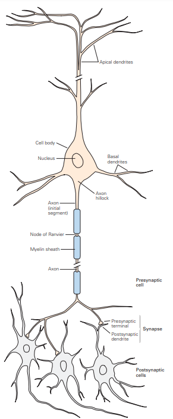


The cell body or __soma__ is the metabolic center of the cell. It contains the nucleus, which contains the genes of the cell, and the endoplasmic reticulum, an extension of the nucleus where the cell’s proteins are synthesized. 
The cell body usually gives rise to two kinds of processes: several short _dendrites_ and one long, _tubular axon_. Dendrites branch out in tree-like fashion and are the main apparatus for receiving incoming signals from other nerve cells. The axon typically extends some distance from the cell body and carries signals to other neurons.
An axon can convey electrical signals over distances ranging from 0.1 mm to 2 m. These electrical signals, called action potentials, are initiated at a specialized trigger region near the origin of the axon called the initial segment from which they propagate down the axon

### 2.	Why do computational modelling?
- A well-constructed and useful model is one that can be used to increase our understanding of the phenomena under investigation and to predict reliably the behaviour of the system under the given circumstances. 
	
	1. Modelling is used as an aid to reasoning.
	2. Modelling removes ambiguity from theories. _Verbal theories can mean different things to different people, but formalising them in a mathematical model removes that ambiguity._
	3. The models that have been developed for many neurobiological systems, particularly at the cellular level, have reached a degree of sophistication such that they are accepted as being adequate representations of the neurobiology
	4. Advances in computer technology mean that the number of interacting elements, such as neurons, that can be simulated is very large and representative of the system being modelled.

- __Parameters__: A key aspect of computational modelling is in determining values for model parameters. __Often these will be estimates at best, or even complete guesses. Using the model to show how sensitive a solution is to the varying parameter values is a crucial use of the model.__

_Often the models we devise in neuroscience are considerably complex, and mathematical analysis is of less help. Furthermore, the equations in a mathematical model often contain a large number of parameters. While some of the values can be specified (for example, from experimental data), usually not all parameter values are known. In some cases, additional experiments can be run to determine some values, but many parameters will remain __free parameters__ (i.e. not known in advance). How to determine the values of free parameters is a general modelling issue, not exclusive to neuroscience. An essential part of the modeller’s toolkit is a set of techniques that enable free parameter values to be estimated._
 
Amongst these techniques are:

__Optimisation techniques__: automatic methods for finding the set of parameter values for which the model’s output best fits known experimental data. This assumes that such data is available and that suitable measures of goodness of fit exist. Optimisation involves changing parameter values systematically so as to improve the fit between simulation and experiment. Issues such as the uniqueness of the fitted parameter values then also arise.

__Sensitivity analysis:__ finding the parameter values that give stable solutions to the equations; that is, values that do not change rapidly as the parameter values are changed very slightly. 

__Constraint satisfaction:__ use of additional equations which express global constraints (such as, that the total amount of some quantity is conserved). This comes at the cost of introducing more assumptions into the model.

 __Educated guesswork:__ use of knowledge of likely values. For example, it is likely that the reversal potential of potassium is around −80mV in many neurons in the central nervous system (CNS). In any case, results of any automatic parameter search should always be subject to a ‘sanity test’. For example, we ought to be suspicious if an optimisation procedure suggested that the reversal potential of potassium was hundreds of millivolts.


### 3. Introducing _NEURON_

The NEURON software, developed at Duke University, is a simu-
lation environment for modeling individual neurons and networks of
neurons. The NEURON environment is a self-contained environment
allowing interface through its GUI, or via scripting with hoc or python 

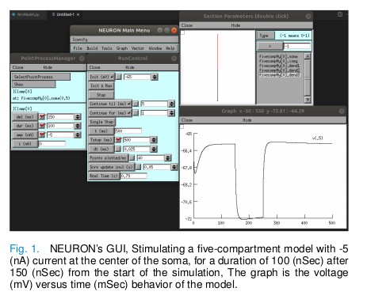

We will be using NEURON – VERSION 7.8.1 as our primary
simulation tool, NEURON is primarily used to simulate the full
experiments on the models, starting from stimulating the model,
recording the model’s behavior, and tuning the model’s parameters
according to the desired behavior.

By writing instructions in NEURON’s programming language ,'hoc', we can specify a model that descripes the desired model topology and different channels and their respective paramerters 

as a simple Example :
    
```javascript
    ///////////////////////// 
	/* model specification*/
    /////////////////////////
    
    /////// topology ////////
     create soma, apical, basilar, axon 
     connect apical(0), soma(1) 
     connect basilar(0), soma(0) 
     connect axon(0), soma(0) 
     
     /////// geometry //////// 
     soma { L = 30 diam = 30 nseg = 1 }
     axon { L = 1000 diam = 1 nseg = 37 }
	
	/////// biophysics ////// 
	forall { Ra = 100 cm = 1 } 
	soma { insert pas g_pas = 0.0002 e_pas = -65 } 
	axon { insert pas g_pas = 0.0002 e_pas = -65 }
	...
```

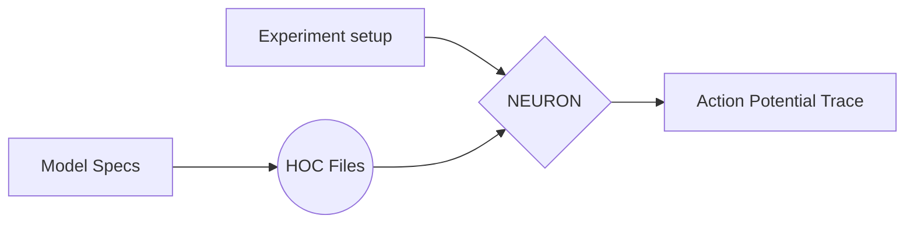


### 4. what is an action potential ?


In neurons, as in other cells, a measurement of the voltage across the membrane using an intracellular electrode (Figure 2.1) shows that there is an electrical potential difference across the cell membrane, called the membrane potential. In neurons the membrane potential is used to transmit and integrate signals, sometimes over large distances. The resting membrane potential is typically around −65mV, meaning that the potential inside the cell is more negative than that outside.


The electrical properties which underlie the membrane potential arise from the separation of intracellular and extracellular space by a cell membrane. The intracellular medium, cytoplasm, and the extracellular medium contain differing concentrations of various ions. Some key inorganic ions in nerve cells are positively charged cations, including sodium (Na+), potassium (K+), calcium (Ca2+) and magnesium (Mg2+), and negatively charged anions such as chloride (Cl−). Within the cell, the charge carried by anions and cations is usually almost balanced, and the same is true of the extracellular space. Typically, there is a greater concentration of extracellular sodium than intracellular sodium, and conversely for potassium,

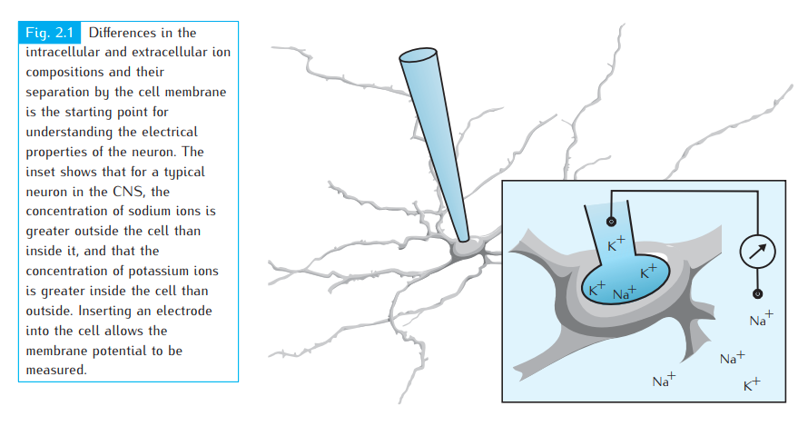

The key components of the membrane are shown in Figure 2.2. The bulk of the membrane is composed of the 5 nm thick lipid bilayer. It is made up of two layers of lipids, which have their hydrophilic ends pointing outwards and their hydrophobic ends pointing inwards. It is virtually impermeable to water molecules and ions. This impermeability can cause a net build-up of positive ions on one side of the membrane and negative ions on the other. This leads to an electrical field across the membrane, similar to that found between the plates of an ideal electrical capacitor

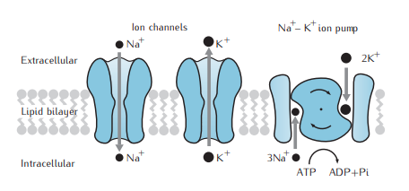


__Ion channels__ are pores in the lipid bilayer, made of proteins, which can allow certain ions to flow through the membrane. A large body of biophysical work, starting with the work of Hodgkin and Huxley (1952d) described in Chapter 3 and summarised in Chapter 5, has shown that many types of ion channels, referred to as active channels, can exist in open states, where it is possible for ions to pass through the channel, and closed states, in which ions cannot permeate through the channel. Whether an active channel is in an open or closed state may depend on the membrane potential, ionic concentrations or the presence of bound ligands, such as neurotransmitters. In contrast, passive channels do not change their permeability in response to changes in the membrane potential. Sometimes a channel’s dependence on the membrane potential is so mild as to be virtually passive. Both passive channels and active channels in the open state exhibit selective permeability to different types of ion. Channels are often labelled by the ion to which they are most permeable. _For example, potassium channels primarily allow potassium ions to pass through. There are many types of ion channel, each of which has a different permeability to each type of ion._
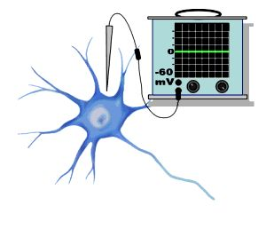
.jpeg)
.jpeg)
.jpeg)

The __potential difference__ across a nerve cell membrane can be measured with a microelectrode whose tip is so small (about a micron) that it can penetrate the cell without producing any damage. When the electrode is in the bath (the extracellular medium) there is no potential recorded because the bath is isopotential. If the microelectrode is carefully inserted into the cell, there is a sharp change in potential. The reading of the voltmeter instantaneously changes from 0 mV, to reading a potential difference of -60 mV inside the cell with respect to the outside. The potential that is recorded when a living cell is impaled with a microelectrode is called the resting potential, and varies from cell to cell. Here it is shown to be -60 mV, but can range between -80 mV and -40 mV, depending on the particular type of nerve cell. In the absence of any stimulation, the resting potential is generally constant.

Intracellular recordings (Figure 3.1) demonstrate that __action potentials__ are characterised by a sharp increase in the membrane potential (depolarisation of the membrane) followed by a somewhat less sharp decrease towards the resting potential (repolarisation). This may be followed by an afterhyperpolarisation phase in which the membrane potential falls below the resting potential before recovering gradually to the resting potential.

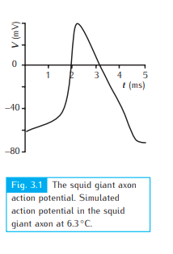


__Components of the Action Potentials__

The action potential consists of several components (Figure 1.3B). The threshold is the value of the membrane potential which, if reached, leads to the all-or-nothing initiation of an action potential. The initial or rising phase of the action potential is called the depolarizing phase or the upstroke. The region of the action potential between the 0 mV level and the peak amplitude is the overshoot. The return of the membrane potential to the resting potential is called the repolarization phase. There is also a phase of the action potential during which time the membrane potential can be more negative than the resting potential. This phase of the action potential is called the undershoot or the hyperpolarizing afterpotential.  In Figure 1.4, the undershoots of the action potentials do not become more negative than the resting potential because they are "riding" on the constant depolarizing stimulus.

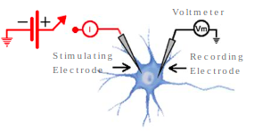
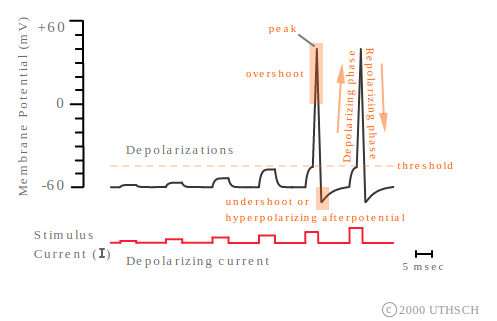

### 5.	what affects action potenials (model parameters , channels...)?

__Voltage-Dependent Conductances__

Na+ is critical for the action potential in nerve cells. As shown in Figure 2.1, action potentials are repeatedly initiated as the extracellular concentration of Na+ is modified. As the concentration of sodium in the extracellular solution is reduced, the action potentials become smaller.
at the peak of the action potential, the membrane becomes highly permeable to sodium.

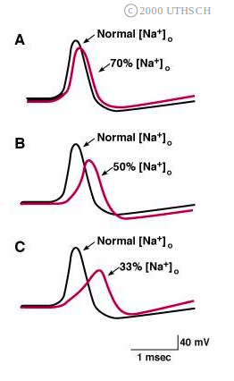

an important property of the voltage-dependent Na+ channels. Note that the permeability increases rapidly and then, despite the fact that the membrane potential is clamped, the permeability decays back to its initial level. This phenomenon is called inactivation. The Na+ channels begin to close, even in the continued presence of the depolarization. Inactivation contributes to the repolarization of the action potential. However, inactivation is not enough by itself to account fully for the repolarization.


In addition to voltage-dependent changes in Na+ permeability, there are voltage-dependent changes in K+ permeability. These changes can be measured with the voltage-clamp technique as well. The figure shown to above indicates the changes in K+ conductance as well as the Na+ conductance. There are two important points.

First, just as there are channels in the membrane that are permeable to Na+ that are normally closed but then open in response to a voltage, there are also channels in the membrane that are selectively permeable to K+. These K+ channels are normally closed, but open in response to depolarization.

Second, a major difference between the changes in the K+ channels and the changes in the Na+ channels is that the K+ channels are slower to activate or open. (Some K+ channels also do not inactivate.)  Note that the return of the conductance at the end of the pulse is not the process of inactivation.  With the removal of the pulse, the activated channels are deactivated.

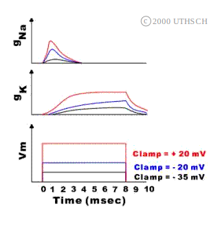


A positive feedback cycle rapidly moves the membrane potential toward its peak value, which is close but not equal to the Na+ equilibrium potential. Two processes which contribute to repolarization at the peak of the action potential are then engaged. First, the Na+ conductance starts to decline due to inactivation. As the Na+ conductance decreases, another feedback cycle is initiated, but this one is a downward cycle. Sodium conductance decreases, the membrane potential begins to repolarize, and the Na+ channels that are open and not yet inactivated are deactivated and close. Second, the K+ conductance increases. Initially, there is very little change in the K+ conductance because these channels are slow to open, but by the peak of the action potential, the K+ conductance begins to increase significantly and a second force contributes to repolarization. As the result of these two forces, the membrane potential rapidly returns to the resting potential. At the time it reaches -60 mV, the Na+ conductance has returned to its initial value. Nevertheless, the membrane potential becomes more negative (the undershoot or the hyperpolarizing afterpotential).

The key to understanding the hyperpolarizing afterpotential is in the slowness of the K+ channels. Just as the K+ channels are slow to open (activate), they are also slow to close (deactivate). Once the membrane potential starts to repolarize, the K+ channels begin to close because they sense the voltage. However, even though the membrane potential has returned to -60 mV, some of the voltage-dependent K+ channels remain open. Thus, the membrane potential will be more negative than it was initially. Eventually, these K+ channels close, and the membrane potential returns to -60 mV.

Why does the cell go through these elaborate mechanisms to generate an action potential with a short duration? Recall how information is coded in the nervous system. If the action potential was about one msec in duration, the frequency of action potentials could change from once a second to a thousand a second. Therefore, short action potentials provide the nerve cell with the potential for a large dynamic range of signaling.

shows a schematic diagram of an axon and the charge distributions that would be expected to occur along the membrane of that axon. Positive charges exist on the outside of the axon and negative charges on the inside. Now consider the consequences of delivering some stimulus to a point in the middle of the axon. If the depolarization is sufficiently large, voltage-dependent sodium channels will be opened, and an action potential will be initiated.

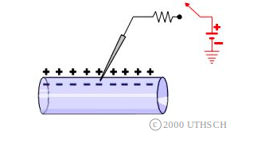
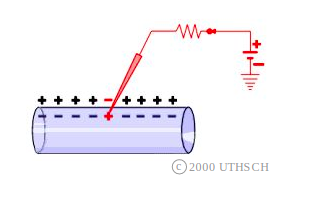
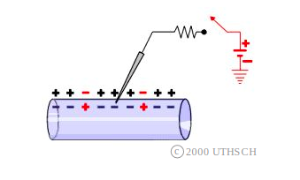
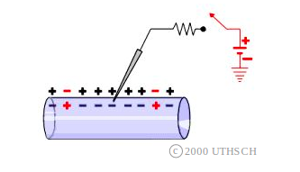


### 6.	what are the possible ways to compare two action potentials?  (point-to-point vs features based comparison)
		pass

### 7. 	what features are we extracting ? (list them with pics and sudo code)
  
1. time constant (tuo)
2. internal resistance (resistance of the axoplasm) (Ri)

Time Constant. First, consider a thermal analogue. Place a block of metal at 10oC on a hotplate at 100oC. How would the temperature change? It will increase from its initial value of 10oC to a final value of 100oC. But the temperature will not change instantly. In fact, it would change as an exponential function of time. An analogous situation occurs in nerve cells, when they receive an instantaneous stimulus. The figure at right represents an idealized nerve cell. The recording electrode initially measures a potential of -60 mV (the resting potential). At some point in time (time 0), the switch is closed. The switch closure occurs instantaneously and as a result of the instantaneous closure, instantaneous current flows through the circuit. (This is equivalent to slamming the block of metal on the hotplate.) Note that despite the fact that this stimulus changes instantly, the change in potential does not occur instantaneously. It takes time for the potential to change from its initial value of -60 mV to its final value of -50 mV. There is a total of 10 mV depolarization, but the change occurs as an exponential function of time.
There is a convenient index of how rapidly exponential functions change with time. The index is denoted by the symbol τ and called the time constant. It is defined as the amount of time it takes for the change in potential to reach 63% of its final value. (Why 63%?) In this example, the potential changes from -60 to -50 and the 63% value is -53.7 mV. Thus, the time constant is 10 msec. The smaller the time constant, the more rapid will be the change in response to a stimulus. Therefore, if this neuron had a time constant of 5 msec, then in 5 msec the membrane potential would reach -53.7 mV. The time constant is analogous to the 0 to 60 rating of a high performance car; the lower the 0 to 60 rating, the faster the car. The lower the time constant, the faster or more rapidly a membrane will respond to a stimulus. The effects of the time constant on propagation velocity will become clear below.

The time constant is a function of two properties of membranes, the membrane resistence (Rm ) and the membrane capacitance (Cm ). Rm is the inverse of the permeability; the higher the permeability, the lower the resistance, and vice versa. Membranes, like the physical devices known as capacitors, can store charge. When a stimulus is delivered, it takes time to charge up the membrane to its new value.

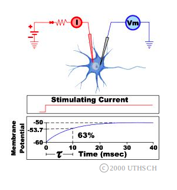
