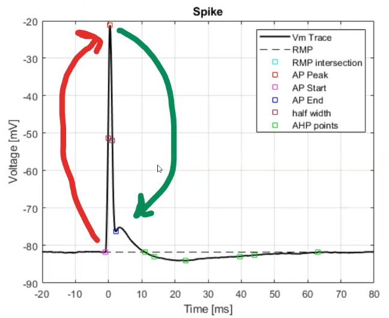
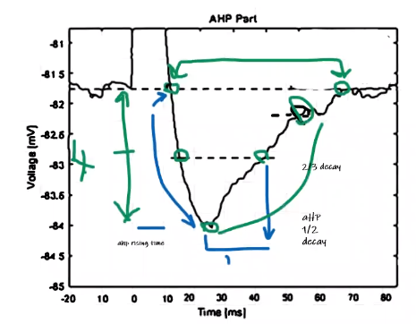

# Meeting Notes (more like a Summary)

1. Na+
   -  Na+ ions flows into the cell
   -  Affects the Depolarization phase (cell potential becomes more Positive)
   - affects the spike hight
2. KA+ 
   -  Ka+ ions flows out of the cell
   - affects the Repolarization phase (cell potential becomes more negative)
   - helps the cell potential become more stable quicker
   - if ZERO , cell still repolarizes but slower 
   - affects the spike width

1. AP Width (Measured Prop.)
   - Time from AP half-amplitude value in Depolarization, till the same value is reached in Repolarization phase   
2. AP Height (Measured Prop.)
   - Difference betweent __AP-Start__ and __AP-Peak__ potentials

5. AHP-Depth/AHP-Depth (Measured Prop.)
   - Diff. between Resting mem. pot. and min pot. in Hyper-rep. phase
6. AHP-duration 
   - Hyper-rep. phase time ...
   - time from AHP-Start(resting mem. pot.) till AHP-End (resting mem. pot. agian) (Noisy) 
7. AHP-Half-duration 
   - time between AHP-half values 
8. AHP-Half-decay
   - time from AHP-peak to AHP-half valve
9.  AHP-rising-time
   - time from AHP-Start till AHP-peak

   - AP is recorded from the Soma,  but the cell is estimulated from the axon (Initial segment) (Antidromic) for __1 (ms) duration__ __*(NOT Clear, some silght variantions cause significant diff in the spike)*__ and a slightly higher current from the rheobase (+5 nA)

   - 'Rheobase' is the min Current on a long duration (+50 ms) (bigger that the Tau of the cell X5), that causes a spike  and is estimulated from the soma  __*(NOT CLEAR , how to detect a spike)*__

## TODO :
Look up *__NERNST Reversal Potential__* 
   - `ena` variable in hoc files